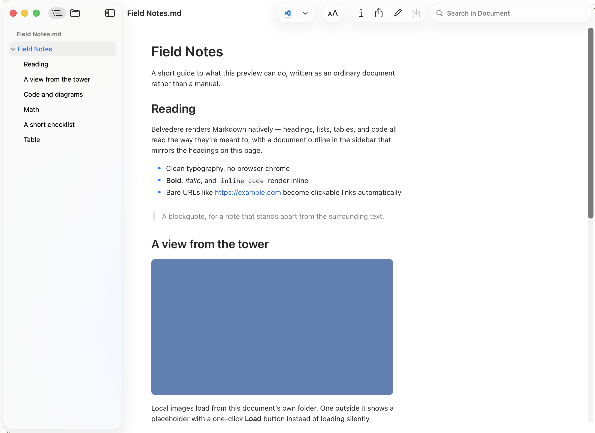
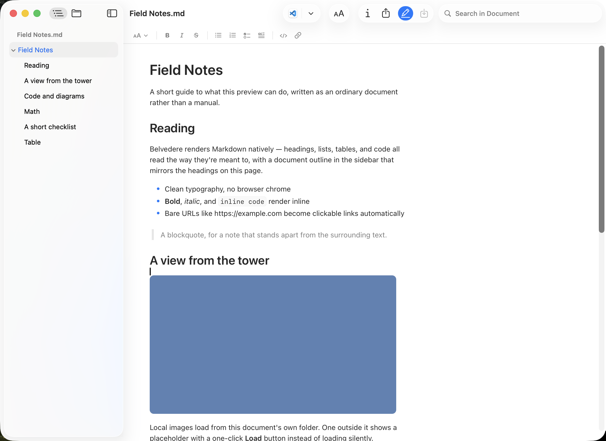
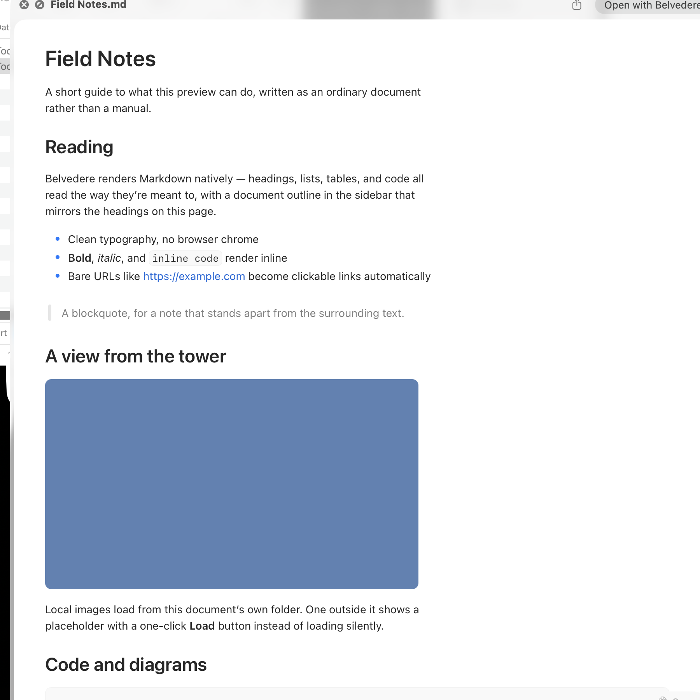
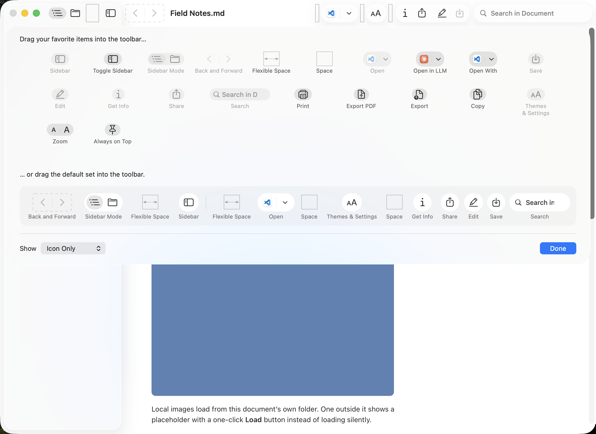

> ## ⚠️ This is a fork — Belvedere
>
> [`inquinity/belvedere`](https://github.com/inquinity/belvedere) is a fork of
> [pluk-inc/markdown-preview](https://github.com/pluk-inc/markdown-preview) that removes the
> app's outbound network connections (Sentry, PostHog, Sparkle). It ships as **Belvedere**,
> installed with `brew install --cask inquinity/tap/belvedere`.
> **[docs/FORK-NOTES.md](docs/FORK-NOTES.md)** is the source of truth for how this repo
> differs from the text below. In particular:
>
> - The **Installation** section is correct for this fork. **Crash reporting**,
>   **Anonymous usage analytics**, and the Sparkle/Sentry parts of **Building from source**
>   describe upstream — those integrations are stubbed or excised here.
> - **Building and releasing** run through `just` (`brew install just`; `just --list`),
>   whose recipes wrap the fork's scripts in `bin/` (not `scripts/`). Releasing is
>   `just release <seg>` then `just publish --go` — see
>   [docs/RELEASE-AUTOMATION.md](docs/RELEASE-AUTOMATION.md). Upstream's Amore pipeline and
>   `scripts/release.sh` do not exist here.
> - The release/cask **badges** below and the **Special Sponsor** / **Acknowledgments**
>   sections are upstream's.
>
> Everything below this block is upstream's README, preserved as-is.

<h1 align="center">Markdown Preview</h1>

<p align="center">
  
</p>

<p align="center">
  A fast, native macOS app for reading Markdown files.
</p>

<p align="center">&nbsp;&nbsp;&nbsp;&nbsp;</p>

<p align="center">
  <a href="https://buymeacoffee.com/pluk">
    
  </a>
</p>

---

> Drop a `.md` on the icon (or set Markdown Preview as your default handler) and get a clean, scrollable preview with a real document outline — no Electron, no browser tab.

## Installation

This fork ([`inquinity/belvedere`](https://github.com/inquinity/belvedere)) ships as
**Belvedere** through a public Homebrew tap:

```sh
brew install --cask inquinity/tap/belvedere
```

Or grab the latest signed and notarized DMG from the tap's
[Releases](https://github.com/inquinity/homebrew-tap/releases) page.

> Upstream Markdown Preview is a separate app, available as `brew install --cask
> markdown-preview` from the [official cask repository](https://formulae.brew.sh/cask/markdown-preview).

## Screenshots

<p align="center">
  
</p>

<p align="center">
  <em>Edit Markdown directly with a native formatting toolbar:</em>
</p>

<p align="center">
  
</p>

<p align="center">
  <em>Quick Look preview — spacebar a <code>.md</code> in Finder:</em>
</p>

<p align="center">
  
</p>

<p align="center">
  <em>Customize the toolbar — drag in Print, Copy, Zoom and the rest from <em>View → Customize Toolbar…</em></em>
</p>

<p align="center">
  
</p>

## Features

- **Native rendering** — `WKWebView` pipeline backed by [swift-markdown](https://github.com/swiftlang/swift-markdown), with heading anchors and link handling.
- **Edit Mode** — edit Markdown in place with a formatting toolbar for headings, emphasis, lists, quotes, code, and links. Toggle it from the toolbar or with <kbd>⌘E</kbd>, then save with <kbd>⌘S</kbd>.
- **Mermaid diagrams** — fenced `mermaid` code blocks render as diagrams in both the app and Quick Look previews, using a bundled renderer so previews work offline without a CDN request.
- **Math equations** — LaTeX inline (`$x_1 + x_2$`), display (`$$\int_0^1 x^2\,dx$$`), and fenced `math` blocks render with a bundled KaTeX. Selecting a rendered formula and copying yields the original LaTeX source (via the official `copy-tex` extension).
- **Document outline** — sidebar TOC that mirrors your headings; click to jump.
- **Inspector panel** — toggleable side panel with file metadata.
- **In-document search** — toolbar search field plus standard <kbd>⌘F</kbd> / <kbd>⌘G</kbd> / <kbd>⌘⇧G</kbd> for next/previous match.
- **Open With** — switch to your real editor (VS Code, Cursor, Zed, Sublime, BBEdit, Nova, CotEditor, TextMate, MacVim, Xcode, TextEdit) without leaving the preview. The list filters to apps that actually declare an editor role for Markdown, and remembers your pick.
- **Open in LLM** — send the current Markdown file to Codex, Claude, or ChatGPT from the toolbar. Supported apps open with file or folder context where possible, with a copy-and-open fallback for longer prompts.
- **Text zoom** — bump preview text up or down with trackpad pinch, the toolbar's <kbd>A A</kbd> control, or <kbd>⌘+</kbd> / <kbd>⌘−</kbd> / <kbd>⌘0</kbd>. Discrete Safari-style stops from 50% to 300%.
- **Customizable toolbar** — drag in the items you actually use (Print, Copy, Zoom, Sidebar, Open With, Inspector, Share, Search) via *View → Customize Toolbar…* Standard AppKit affordance, your layout sticks across launches.
- **Share = copy the source** — the share toolbar feeds the picker the Markdown text itself, so **Copy** writes the raw source to the clipboard (great for pasting into ChatGPT / Claude), and Mail, Messages, and Notes get the content in the body instead of a file URL.
- **Quick Look extension** — system-wide `.md` previews from Finder spacebar, Spotlight, and Mail attachments without launching the app.
- **Command line tools** — install `mdp`, `md-preview`, and `markdown-preview` from the app menu, then open files or folders from any shell with commands like `mdp README.md` or `mdp .`.
- **URL scheme** — open a file or folder from a browser link or another app with `md-preview://file/<absolute path>` (e.g. `md-preview://file/Users/me/project/README.md`), the same shape as `cursor://file/…`. Percent-encode special characters in the path (a space becomes `%20`).
- **Default handler** — offers to register itself as the default `.md` opener on first launch.

## Supported file types

`.md`, `.markdown`, `.mdown`, `.txt`
UTI: `net.daringfireball.markdown`

## Requirements

- macOS 15 or later
- Apple Silicon or Intel

## Building from source

> _This fork: clone `inquinity/belvedere` instead, and build with `just build`
> (`brew install just`). Swift Package Manager no longer resolves Sparkle or Sentry —
> both were removed. See the fork banner at the top._

```sh
git clone git@github.com:pluk-inc/markdown-preview.git
cd markdown-preview
open markdown-preview.xcodeproj
```

Build and run the `markdown-preview` scheme. Swift Package Manager will resolve [Sparkle](https://github.com/sparkle-project/Sparkle), [Sentry](https://github.com/getsentry/sentry-cocoa), and [swift-markdown](https://github.com/swiftlang/swift-markdown) on first build.

### Crash reporting

> _Not this fork: the Sentry integration is stubbed — no crash reports are sent. The section
> below describes upstream._

Release builds submit native crash reports to the `pluk-inc/markdown-preview` Sentry project. The integration does not collect performance traces, session data, breadcrumbs, network requests, user information, document contents, or file paths. Users can turn reporting off in Markdown Preview > Settings > Privacy; on later launches, the Sentry SDK will not initialize at all.

The committed DSN is a public client key. Release archives upload the app dSYM with `sentry-cli`; authenticate locally with `sentry-cli login` and keep that authentication token outside the repository.

### Anonymous usage analytics

> _Not this fork: the PostHog integration is stubbed — no analytics events are sent. The
> section below describes upstream._

Release builds can submit at most one anonymous `app became active` event per installation per UTC day when Markdown Preview becomes active. The event contains a random installation identifier, app version, macOS major version, processor architecture, locale country or region, and the flag that prevents PostHog from creating a person profile. It is used to count daily and monthly active installations and understand basic platform compatibility. It does not contain document contents, file names or paths, actions, screens, precise location, personal information, or advertising identifiers. Users can disable it from Settings > Privacy.

The PostHog project token is injected from the gitignored `Secrets.xcconfig`. Copy `Secrets.xcconfig.example` to `Secrets.xcconfig` and set `POSTHOG_PROJECT_TOKEN` before making a release build. If the token is absent, or for a Debug build, analytics remains disabled. Every event disables GeoIP enrichment, and the PostHog project must also be configured to discard IP data in Project Settings > General.

## Project layout

> _This fork: the fork's own scripts are in `bin/` (`build.sh`, `build-release.sh`,
> `publish-release.sh`, …); `scripts/` holds only upstream tooling, and there is no
> `appcast.xml`. See the fork banner._

```
md-preview/         Main app target (AppKit, WKWebView)
quick-look/         Quick Look extension (.appex)
scripts/            Release & rollback automation
Version.xcconfig    Marketing & build version (single source of truth)
appcast.xml         Sparkle update feed
```

## Releasing

> _Not this fork. Releases here are `bin/build.sh --release` plus the Homebrew tap —
> see [docs/RELEASE-AUTOMATION.md](docs/RELEASE-AUTOMATION.md). Amore, `appcast.xml`,
> `scripts/release.sh` and `scripts/rollback-release.sh` do not exist in this fork. The
> section below describes upstream._

Releases are driven by [Amore](http://amore.computer/) — it handles building, code signing, notarization, DMG creation, S3 upload, and Sparkle appcast publishing in one shot.

Bump `MARKETING_VERSION` and `CURRENT_PROJECT_VERSION` in `Version.xcconfig`, then:

```sh
./scripts/release.sh
```

Use `./scripts/rollback-release.sh` to revert the appcast pointer if a release misbehaves.

### Contributing


Pull requests are welcome. For larger changes, please open an issue first to discuss what you'd like to change.

1. Fork the repo and create your branch from `main`.
2. Run the app and verify the change end-to-end (UI changes need a manual smoke test — there's no UI test suite yet).
3. Keep PRs focused; one logical change per PR.
4. Match the existing Swift style (no formatter is enforced; mirror nearby code).

<h2 align="center" style="color: #8a8a8a;">Special Sponsor</h2>

<br />

<p align="center">
  <a href="https://pluk.sh">
    
  </a>
  &nbsp;&nbsp;&nbsp;&nbsp;
  <a href="https://amore.computer">
    
  </a>
</p>

## Support

Markdown Preview is free and MIT-licensed. If it saved you a browser tab, you can [buy us a coffee](https://buymeacoffee.com/pluk).

## Acknowledgments
- [Amore](http://amore.computer/) — MacOS release automation (signing, notarization, DMG, hosting, appcast)
- [swift-markdown](https://github.com/swiftlang/swift-markdown) — Markdown parser (Apple, cmark-gfm-backed)
- [Mermaid](https://mermaid.js.org/) — Bundled diagram renderer for `mermaid` fenced code blocks
- [KaTeX](https://katex.org/) — Bundled math typesetter for inline `$…$`, display `$$…$$`, and ` ```math ` blocks
- [Sparkle](https://sparkle-project.org) — Auto-update framework
- [Sentry](https://sentry.io) — Privacy-filtered native crash reporting
- [LottieFiles](https://lottiefiles.com/) — Animated README logo

## License

[MIT](LICENSE)
